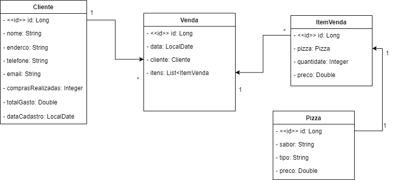

<h1>🍕 Pizzaria</h1>
API feita para controlar as vendas de uma pizzaria. 

## O que a API vai fazer:
- Cadastro das informações das pizzas: sabor, preço e tipo.
- Cadastro e controle dos clientes.
- Realização e finalização das vendas.
- quantidade de pizzas já adquirido por cada cliente e o valor gasto por ele.

## 🛠 Modelo de Classe

## Desafio 01
- Criar modelagem.
- Implementar classes.
- Criar projeto Spring Boot.
- Criar repositório Git.

## Desafio 02

Neste desafio foram criados os controllers de nossa API.

Foi implementado os ResponseEntity para manipular as respostas HTTP. Juntamente foi utilizado <a src="https://www.postman.com/">Postman</a> para a realização dos testes.

Foi criado a documentação da API com base na especificação OpenAPI 3. Para isso foi adicionada a dependência springdoc-openapi-ui ao nosso pom.xml.

